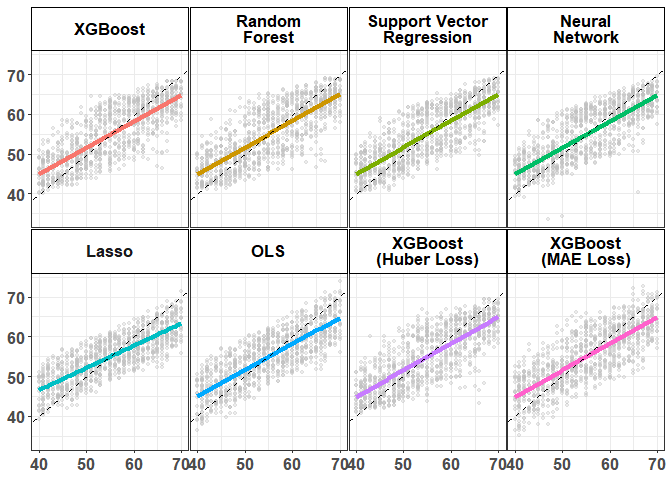
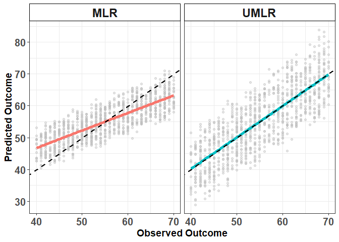
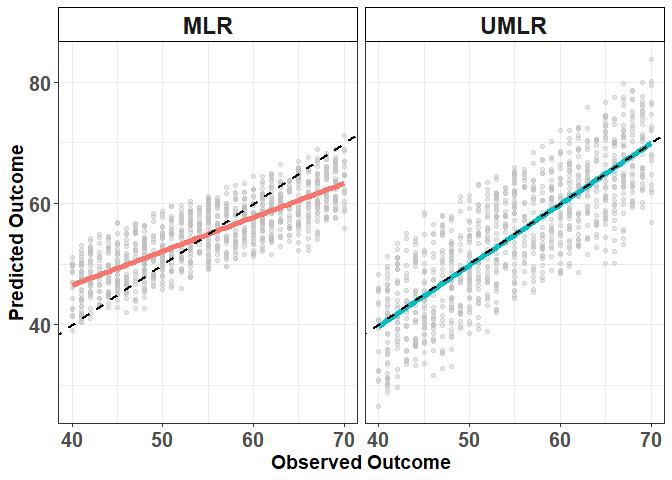

Systematic Prediction Bias
================

# Data Generation

Load required libraries for competing methods

## Generating Training data set

## Generating Testing data set

# Model fitting

## Unbiased Machine Learning Regression (UMLR: Lasso version)

**`Lasso_UP`** is the primary function that implements the lasso with constrainst (unbiased lasso):

``` r{class.source="fold-show"}
Lasso_UP(Predictor, Outcome, Lambda)
```

-   Inputs
    -   `Predictor` : Predictor matrix (n x p)
    -   `Outcome` : Outcome vector (n x 1)
    -   `Lambda` : Tuning parameter
-   Output
    -   `betahat` : Estimated regression coefficients
    -   `predict` : Predicted outcome

## Lasso

## Gradient Boosting (XGBoost Squared Loss)

### XGBoost (Huber Loss)

### XGBoost (MAE Loss)

## Random Forest

## Neural Net

## Support Vector Regression

## OLS

# Result

## Systematic Prediction Bias from various ML Methods (Predicted outcome vs Observed outcome) in testing set



## Comparison (MLR vs UMLR) in Prediction

### Training Set (Predicted outcome vs Observed Outcome)



### Testing Set (Predicted outcome vs Observed Outcome)



### Downsteam Association Analysis (Testing Set: Predicted BAG vs Association Variable (Z))


